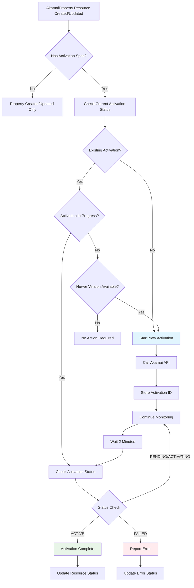
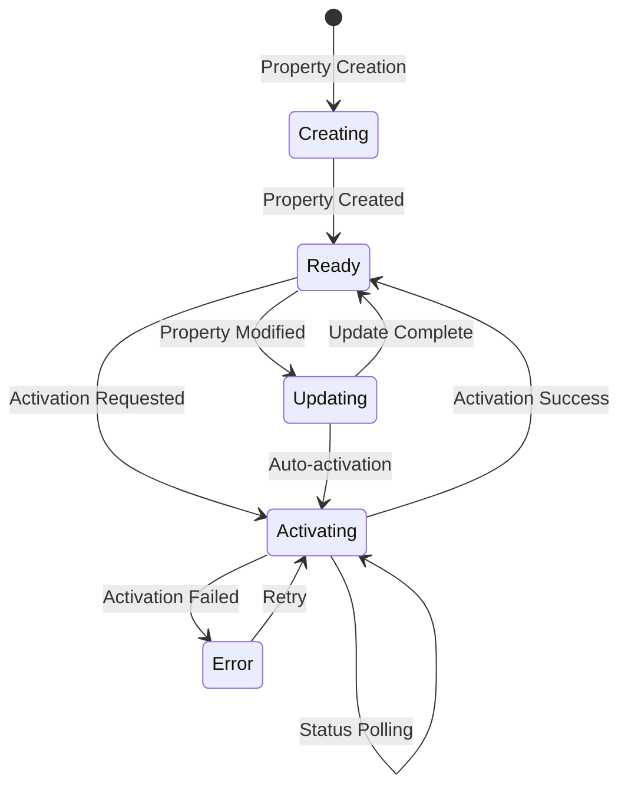
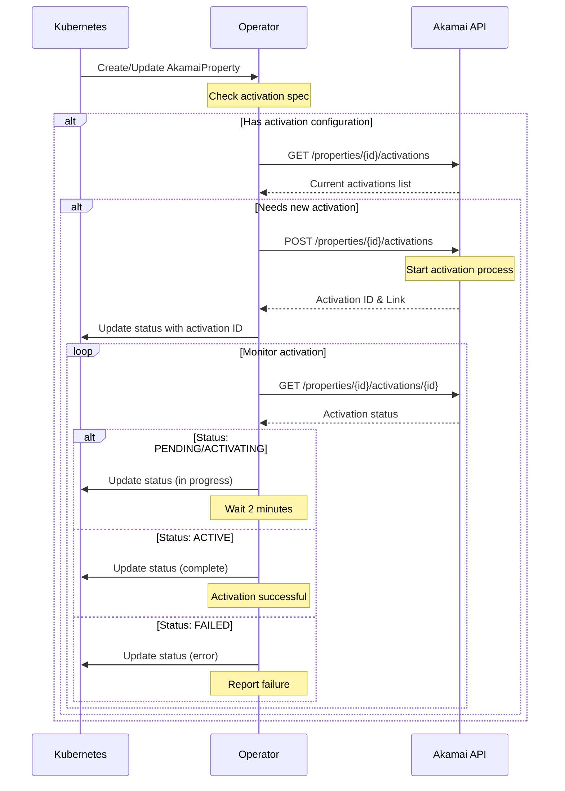
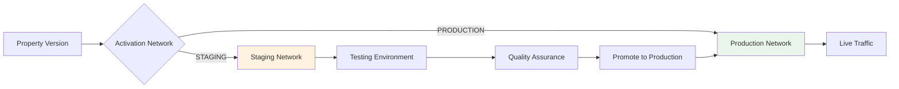
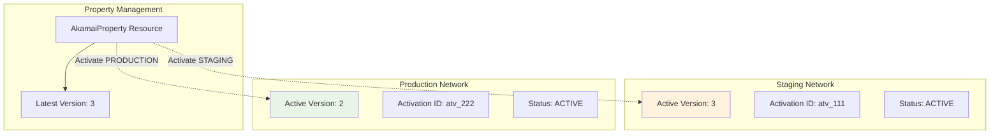
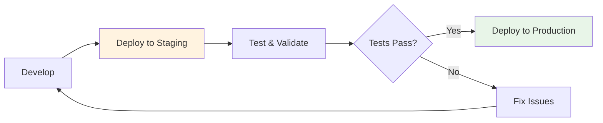
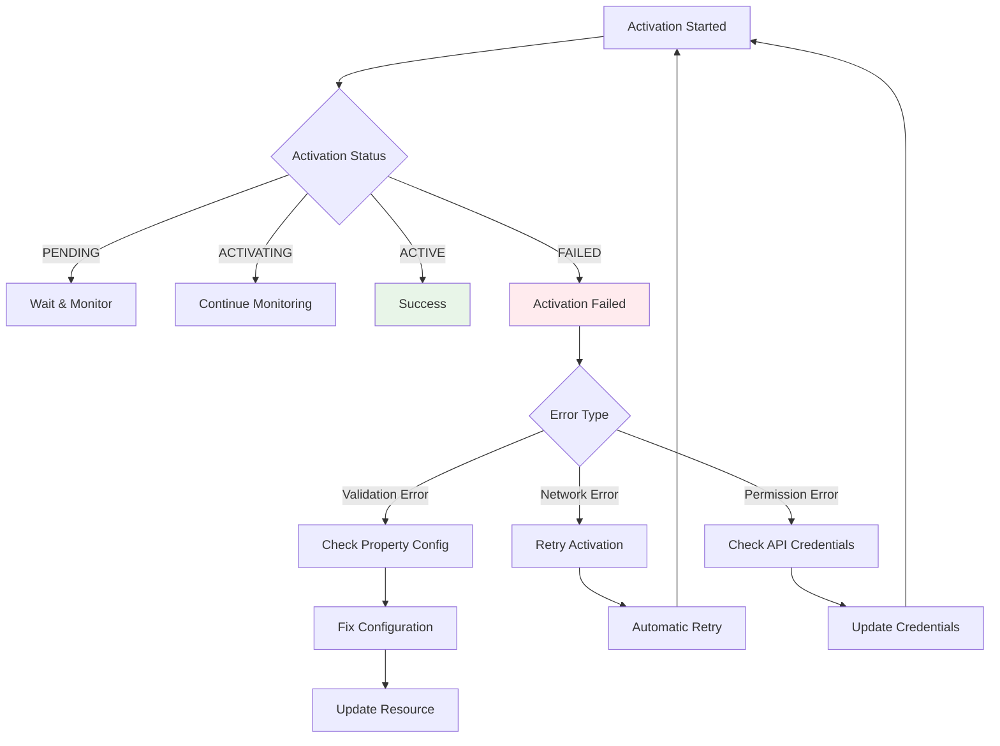

# Property Activation in Akamai Operator

This document explains how property activation works in the Akamai Operator, including the activation lifecycle, API interactions, and status tracking.

## Overview

Property activation is the process of deploying property configurations to Akamai's edge network. The Akamai Operator automates this process by:

1. **Creating** or **updating** property configurations
2. **Activating** properties on specified networks (STAGING or PRODUCTION)
3. **Monitoring** activation progress and status
4. **Tracking** active versions across different networks

## Activation Workflow



## Activation States

The operator tracks activation through several states:



## API Interaction Flow



## Configuration Structure

### Activation Specification

```yaml
apiVersion: akamai.com/v1alpha1
kind: AkamaiProperty
metadata:
  name: my-property
spec:
  # ... property configuration ...
  
  activation:
    # Target network (required)
    network: "STAGING"  # or "PRODUCTION"
    
    # Notification emails (required)
    notifyEmails:
      - "admin@example.com"
      - "devops@example.com"
    
    # Optional fields
    note: "Automated activation via Kubernetes"
    acknowledgeAllWarnings: true
    useFastFallback: false
    fastPush: true
    ignoreHttpErrors: true
```

### Status Tracking

```yaml
status:
  propertyId: "prp_123456"
  latestVersion: 3
  
  # Staging activation info
  stagingVersion: 2
  stagingActivationId: "atv_789012"
  stagingActivationStatus: "ACTIVE"
  
  # Production activation info
  productionVersion: 1
  productionActivationId: "atv_345678"
  productionActivationStatus: "PENDING"
  
  phase: "Activating"
  conditions:
    - type: "Ready"
      status: "False"
      reason: "ActivationInProgress"
      message: "Activation pending on PRODUCTION network"
```

## Network Targeting



## Activation Lifecycle Management

### 1. **Initial Activation**
- Property created with activation spec
- Operator detects new activation requirement
- Calls Akamai API to start activation
- Begins status monitoring

### 2. **Status Monitoring**
- Polls activation status every 2 minutes
- Updates Kubernetes resource status
- Handles state transitions (PENDING → ACTIVATING → ACTIVE)

### 3. **Version Updates**
- When property is updated, new version is created
- Operator detects version mismatch
- Automatically triggers activation of new version

### 4. **Error Handling**
- Failed activations are reported in resource status
- Retry logic with exponential backoff
- Detailed error messages in conditions

## Multi-Network Support



## Monitoring and Observability

### Resource Status Commands

```bash
# View all properties and their activation status
kubectl get akamaiproperties

# Get detailed status including activation info
kubectl describe akamaiproperty my-property

# Watch activation progress in real-time
kubectl get akamaiproperty my-property -w

# Check activation status in YAML format
kubectl get akamaiproperty my-property -o yaml | grep -A 20 status
```

### Example Status Output

```
NAME          PROPERTY ID   LATEST VERSION   STAGING VERSION   PRODUCTION VERSION   PHASE
my-property   prp_123456    3               3                 2                    Activating
```

## Best Practices

### 1. **Staging First Approach**


### 2. **Notification Setup**
- Configure multiple email addresses for activation notifications
- Include both technical and business stakeholders
- Use team distribution lists for broader coverage

### 3. **Fast Fallback Configuration**
- Enable `useFastFallback: true` for production activations
- Allows quick rollback within 1 hour if issues are detected
- Only available when `canFastFallback` is true

### 4. **Activation Notes**
- Use descriptive notes to track activation purposes
- Include ticket numbers, change descriptions, or deployment contexts
- Helps with audit trails and troubleshooting

## Error Scenarios and Recovery



## Advanced Features

### Fast Fallback

When enabled, fast fallback allows quick rollback to the previous version:

```yaml
activation:
  network: "PRODUCTION"
  useFastFallback: true  # Enable fast rollback
  notifyEmails: ["ops@example.com"]
```

- Available for 1 hour after activation
- Only when `canFastFallback` is true
- Provides rapid recovery from deployment issues

### Activation Validation

The operator validates activation requests before submission:

- **Network validation**: Must be "STAGING" or "PRODUCTION"
- **Email validation**: At least one email address required
- **Version validation**: Ensures version exists and is activatable
- **Permission validation**: Checks API credentials and access rights

## Troubleshooting

### Common Issues

1. **Activation Stuck in PENDING**
   - Check Akamai API status
   - Verify network connectivity
   - Review activation logs

2. **Validation Errors**
   - Check property configuration
   - Verify hostnames and certificates
   - Review rule tree structure

3. **Permission Errors**
   - Verify API credentials
   - Check contract and group access
   - Ensure activation permissions

### Debug Commands

```bash
# Check operator logs
kubectl logs -n akamai-operator-system deployment/akamai-operator-controller-manager

# Get resource events
kubectl get events --field-selector involvedObject.name=my-property

# Describe resource for detailed status
kubectl describe akamaiproperty my-property
```

This comprehensive guide covers all aspects of property activation in the Akamai Operator, from basic concepts to advanced troubleshooting scenarios.
